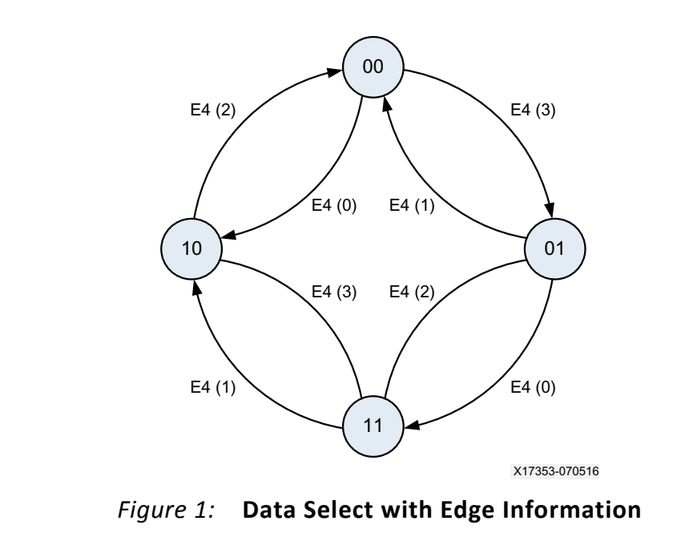
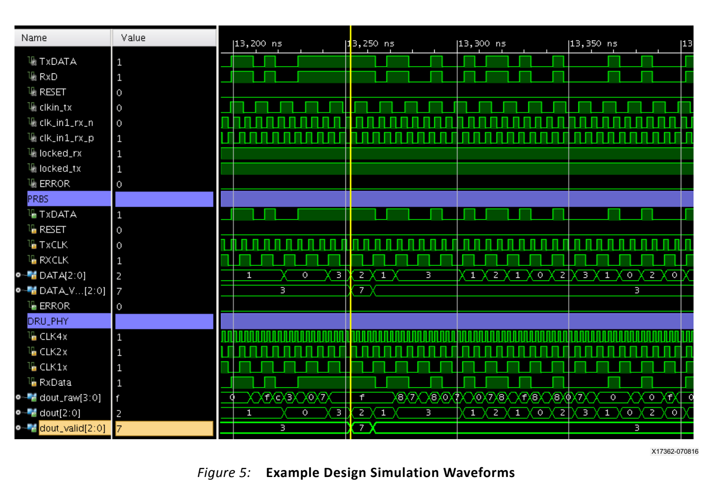

# XAPP1294：基于 IDDR 的 4 倍异步过采样与 DRU

> 一句话总结：XAPP1294 使用本地高速时钟和 `IDDR` 对无随路时钟的异步串行数据进行 4 倍过采样，通过 `E4[3:0]` 定位数据边沿、由四状态 FSM 选择远离边沿的样本，再以每周期输出 1、2 或 3 个有效 bit 的方式补偿收发频率偏差。

## 文档信息与阅读目的

| 项目 | 内容 |
| --- | --- |
| 文档 | XAPP1294 |
| 版本 | v1.0 |
| 日期 | 2016-08-30 |
| 主题 | Lightweight and Scalable 4x Oversampling Asynchronous Data Recovery Unit |
| 本笔记范围 | 4 倍过采样、边沿检测、相位跟踪、bit skip 和输出接口 |

本文只讨论采样与数据恢复机制。

## 核心结论

- XAPP1294 不生成真正的 recovered clock，而是在本地时钟域中恢复完整数据。
- 400 MHz 时钟通过 `IDDR` 双边沿采样形成 800 MSPS，对 200 Mb/s 数据得到 4 samples/UI。
- PHY 将连续四个原始样本整理成 `dout_raw[3:0]`，交给 200 MHz 域中的 DRU。
- `E4[3:0]` 通过比较相邻样本定位数据边沿，FSM 再选择远离边沿的安全采样点。
- 四状态循环相位首尾回绕时，需要用 bit skip 修正输入与本地时钟累计产生的位数差。
- 100 MHz 输出域名义上每周期恢复 2 bit；补偿周期可以输出 1 bit 或 3 bit。
- XAPP1294 与 XAPP881 的 DRU 思想相同，但采样原语、内部样本编号和输出接口不能混用。

## 总体数据流

```text
异步 RxData
    │
    ▼
IDDR：400 MHz 双边沿采样
    │ 800 MSPS
    ▼
四个连续原始样本 dout_raw[3:0]
    │ 200 MHz
    ├──► 相邻样本 XOR ──► E4[3:0]
    │
    ▼
四状态 Data Select FSM
    │
    ▼
安全样本选择与 bit skip
    │ 100 MHz
    ▼
dout[2:0] + dout_valid[2:0]
```

DRU 的核心不是对四个样本做多数表决，而是：

> 先找出数据边沿所在区间，再选取距离边沿较远的样本。

## 时间参数与 4 倍过采样

XAPP1294 以名义 200 Mb/s 数据为例。一个 UI 的宽度为：

$$
T_\text{UI}=\frac{1}{200\text{ MHz}}=5\text{ ns}
$$

400 MHz 采样时钟的周期为：

$$
T_{400M}=\frac{1}{400\text{ MHz}}=2.5\text{ ns}
$$

`IDDR` 同时在时钟上升沿和下降沿采样，因此实际采样率为：

$$
f_\text{sample}=2\times400\text{ MHz}=800\text{ MSPS}
$$

相邻采样点间隔为：

$$
T_\text{sample}=\frac{2.5\text{ ns}}{2}=1.25\text{ ns}
$$

每个 UI 内的采样数为：

$$
N=\frac{800\text{ MSPS}}{200\text{ Mb/s}}=4
$$

按时间顺序定义四个逻辑样本 `S0～S3`：

```text
当前 UI                                      下一 UI
S0          S1          S2          S3       S0'
0 ns        1.25 ns     2.50 ns     3.75 ns  5.00 ns
|-----------|-----------|-----------|---------|
```

这里的 `S0～S3` 只是便于分析的时间编号，不代表 `dout_raw[3:0]` 的实际 RTL 位序。

## IDDR 如何形成四个样本

一个 400 MHz 周期通过双边沿获得两个样本，两个连续周期共得到四个样本：

```text
第一个 400 MHz 周期        第二个 400 MHz 周期
上升沿        下降沿       上升沿        下降沿
S0            S1           S2            S3
```

两个 400 MHz 周期持续 5 ns，正好对应一个 200 Mb/s UI。PHY 随后在 200 MHz 域把四个连续样本整理成 `dout_raw[3:0]`。

### 逻辑时间编号与 RTL 位编号

需要区分两套坐标：

| 坐标 | 用途 |
| --- | --- |
| `S0～S3` | 按时间先后解释四个采样点 |
| `dout_raw[3:0]` | 参考设计 RTL 的实际并行总线编号 |

XAPP1294 正文没有完整列出每个 `dout_raw[n]` 对应哪个 IDDR 边沿及流水周期。因此，不能仅根据总线下标断言 `dout_raw[0]` 是最早或最新样本；精确位序需要结合参考设计源码确认。

## E4 边沿检测

若两个相邻样本不同：

$$
S_a\oplus S_b=1
$$

说明数据边沿位于这两个采样点之间。

用时间编号表达，E4 的原理可以等效写成：

$$
\begin{aligned}
E4[0]&=S0\oplus S1\\
E4[1]&=S1\oplus S2\\
E4[2]&=S2\oplus S3\\
E4[3]&=S3\oplus S0'
\end{aligned}
$$

其中 `S0'` 是下一组的第一个样本，所以 `E4[3]` 表示跨 `dout_raw` 分组边界的连续比较。

例如：

```text
样本： 0     0     1     1
       S0    S1    S2    S3

异或：    0     1     0
          E0    E1    E2
```

边沿位于 `S1` 和 `S2` 之间，DRU 应从离该区间较远的候选样本中取数。

> 上述公式是用于说明原理的工程化等效表达，不是 XAPP1294 正文给出的逐位 RTL 公式；实际位序和跨周期寄存器关系应以参考设计源码为准。

## 四状态相位跟踪器



*图 1：Figure 1 使用 `E4` 边沿信息驱动四状态 Data Select FSM。来源：XAPP1294 v1.0，第 3 页。*

四个状态采用 Gray 编码：

```text
00、01、11、10
```

状态表示当前采用哪一个候选采样相位，不是输入数据值，也不直接等于某个 `E4` 区间。

Figure 1 的状态转移关系与 XAPP881 的四状态相位跟踪器一致：

| 当前状态 | 边沿条件 | 下一状态 |
| --- | --- | --- |
| `00` | `E4[0]=1` | `10` |
| `00` | `E4[1]=1` | `01` |
| `01` | `E4[3]=1` | `00` |
| `01` | `E4[0]=1` | `11` |
| `11` | `E4[2]=1` | `01` |
| `11` | `E4[1]=1` | `10` |
| `10` | `E4[3]=1` | `11` |
| `10` | `E4[2]=1` | `00` |

如果离开当前状态的条件没有成立，FSM 保持原状态。这表示：

- 当前采样点仍远离边沿，可以继续安全取样；
- 没有发生相位调整不等于 DRU 停止工作；
- 长连 0 或长连 1 时没有新的边沿信息，FSM 只能保持已有选择。

输入数据与本地时钟存在微小频差时，边沿相对于本地采样点缓慢漂移。E4 检测区间随之变化，FSM 才逐步切换到相邻的安全相位。

## 循环相位轴

理解状态回绕时，应把四状态序列沿时间展开：

```text
上一数据组                    当前数据组                    下一数据组
... 11    10 | 00    01    11    10 | 00    01 ...
               ↑                       ↑
             分组边界                  分组边界
```

从二进制状态编号看，`10→00` 像是“跳回起点”；但在展开的时间轴上，它表示：

```text
当前组最后一个逻辑相位 → 下一组第一个逻辑相位
```

物理时间仍然向前。反方向的 `00→10` 则跨到相邻数据组的另一侧。二者都是循环相位选择器跨越并行数据组边界，而不是采样时间倒退。

## Bit Skip

正常情况下：

- 100 MHz 输出时钟周期为 10 ns；
- 200 Mb/s 数据在 10 ns 内产生 2 bit；
- 因而每个输出周期名义恢复 2 bit。

收发时钟并非完全同频，输入边沿会相对本地相位持续漂移。当状态在循环相位首尾之间回绕时，两个连续输出选择可能覆盖重复候选位，或者漏掉一个尚未覆盖的候选位。DRU 必须删除重复位或补入遗漏位。

### Negative Bit Skip

Negative bit skip 对应删除一个重复候选位。名义 2-bit 输出周期变为：

```text
1 个有效 bit
```

### Positive Bit Skip

Positive bit skip 对应补入一个尚未覆盖的候选位。名义 2-bit 输出周期变为：

```text
3 个有效 bit
```

这里的 positive/negative 描述输出有效位数相对名义值的 `+1/-1` 调整。判断输入较快或较慢时，应以长期位数守恒来理解：

| 输入相对本地参考 | 若始终输出2 bit的后果 | DRU补偿 |
| --- | --- | --- |
| 输入较快 | 输入累计位数更多，最终会漏位 | 偶尔输出3个有效bit |
| 输入较慢 | 本地输出节拍更快，最终会重复位 | 偶尔只输出1个有效bit |

bit skip 是异步频率匹配的正常机制，不是采样错误。

## 3-bit 数据与 Valid 接口

XAPP1294 的恢复输出为：

```text
dout[2:0]
dout_valid[2:0]
```

`dout_valid` 指示本周期有多少个低位有效：

| 情况 | 有效数据 | `dout_valid` |
| --- | --- | --- |
| Negative bit skip | `dout[0]` | `001` |
| 正常输出 | `dout[1:0]` | `011` |
| Positive bit skip | `dout[2:0]` | `111` |

因此，3-bit 总线不是表示每周期固定输出 3 bit，而是为了容纳：

$$
N-1,\quad N,\quad N+1
$$

在 XAPP1294 中名义值为：

$$
N=2
$$

所以单周期可能得到 1、2 或 3 个有效 bit。



*图 2：Figure 5 展示 bit skip 时 `dout_valid=111`，表示该输出周期包含一个额外有效数据位。来源：XAPP1294 v1.0，第 8 页。*

## 频率偏差与 Bit Skip 周期

若输入与本地参考完全同频，FSM 找到安全相位后可以长期保持，不一定发生周期性 bit skip。

若存在非零频差，相位误差会持续累计。当累计误差达到约一个 UI 时，需要一次位数补偿。以 10,000 ppm 为例：

$$
10{,}000\text{ ppm}=1\%
$$

对 200 Mb/s 数据，平均位数差为：

$$
200\text{ Mb/s}\times1\%=2\text{ Mb/s}
$$

因此平均约每 100 bit 累计 1 bit 差异。这个结果只说明平均补偿频率；实际 bit skip 时刻还取决于初始相位、瞬时抖动和数据边沿分布。

## 设计边界

### 输入需要足够的跳变

DRU 依靠数据跳变更新边沿位置。长连 0 或长连 1 时：

```text
E4[3:0] = 0000
```

FSM 会保持已有采样相位，但无法获得新的相位漂移信息。因此实际数据编码需要提供足够的跳变密度。

### 过采样不能消除亚稳态

异步输入仍可能在某个 IDDR 采样边沿附近跳变。过采样 DRU 的作用是识别边沿附近的不安全样本，并从其他相位选择更稳定的数据；它不能证明所有物理采样寄存器都不会进入亚稳态。

### 频率必须足够接近

该结构假设输入速率和本地采样时钟的名义比例保持不变，频差较小，使边沿能够在相邻 E4 区间之间逐步漂移。若频差过大，FSM 和单周期 `±1 bit` 的输出补偿可能无法持续跟踪。

### 数据位序必须以 RTL 为准

时间编号 `S0～S3`、FSM 状态编号和 `dout_raw[3:0]` 是不同层次的坐标。解释算法时可以按时间排序，但工程接入时必须根据 RTL 核对实际拼接方向和输出位序。

## 与 XAPP881 的关系

| 对比项 | XAPP881 | XAPP1294 |
| --- | --- | --- |
| 采样结构 | IODELAYE1 + Master/Slave ISERDESE1 | IDDR双边沿采样 |
| 内部样本 | 8个重映射样本 | 4-bit raw samples |
| 边沿检测 | `E4[3:0]` | `E4[3:0]` |
| 相位跟踪 | 四状态FSM | 四状态FSM |
| 频差补偿 | bit skip | bit skip |
| 输出方式 | 固定10-bit接口配合clock enable | 3-bit数据配合3-bit valid |

两篇文档共同的算法骨架为：

```text
过采样
  → 相邻样本边沿检测
  → 四状态安全采样点选择
  → 循环相位回绕
  → bit skip速率补偿
```

以下内容不能直接混用：

- XAPP881 的 `Q(0)～Q(7)` 重映射；
- Master/Slave ISERDESE1 输出编号；
- XAPP881 的固定 10-bit 接口和 clock enable；
- XAPP1294 的 `dout_raw[3:0]` 实际位序；
- 两种结构各自的原语和时钟实现。

## FAQ

### 为什么400 MHz能够实现4倍过采样？

400 MHz 的 IDDR 同时使用上升沿和下降沿，实际采样率为 800 MSPS；相对于 200 Mb/s 数据，正好是 4 samples/UI。

### DRU是多数表决器吗？

不是。它利用 XOR 找到相邻样本之间的数据边沿，再由 FSM 选择远离边沿的样本。

### 为什么FSM会保持在同一状态？

只要数据边沿没有靠近当前选择的采样相位，该相位就是安全点，保持状态是正常工作状态。

### `10→00`是不是从较晚时间跳回较早时间？

不是。在展开的循环相位轴上，它表示从当前数据组最后一个逻辑相位进入下一数据组第一个逻辑相位，时间仍然向前。

### 为什么输出有时是1 bit，有时是3 bit？

正常输出为2 bit。输入较慢时偶尔减少1 bit，输入较快时偶尔增加1 bit，以维持长期数据位数守恒。

### 为什么需要同时看`dout`和`dout_valid`？

`dout` 总线宽度固定为3 bit，但每周期实际有效位数可变；用户逻辑必须由 `dout_valid` 判断低1、2或3位是否有效。

## See Also

- [[XAPP881 Virtex-6 4倍异步过采样与DRU]]：相同 DRU 思想的高速 ISERDESE1 实现，包含更详细的循环相位与 bit-skip 图解。
- [[基于IDDR的4倍异步过采样与数据恢复]]：按具体工程时钟缩放并包含 RTL 片段的 IDDR 实现笔记。

## References

- Xilinx, *Lightweight and Scalable 4x Oversampling Asynchronous Data Recovery Unit for Single-Ended or Differential Inputs*, XAPP1294 v1.0, 2016-08-30。
- Xilinx, *Virtex-6 FPGA LVDS 4X Asynchronous Oversampling at 1.25 Gb/s*, XAPP881 v1.1。
- 本地原始文档：`D:\0_MySpace\01_技术文档\05_FPGA_learning\xapp1294-4x-oversampling-async-dru.pdf`

## Tags

`FPGA` `Xilinx` `IDDR` `Oversampling` `DRU` `Bit-Skip` `XAPP1294`
