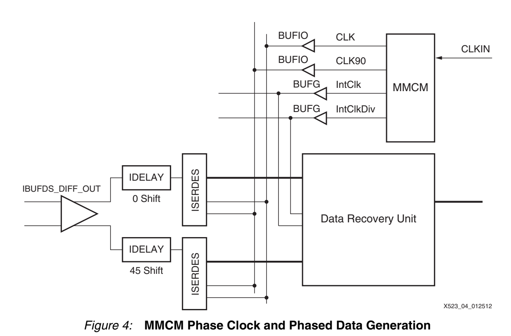
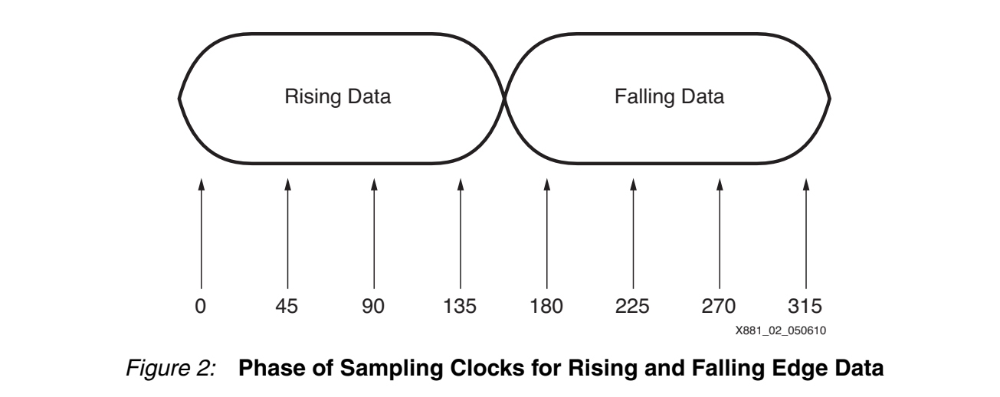
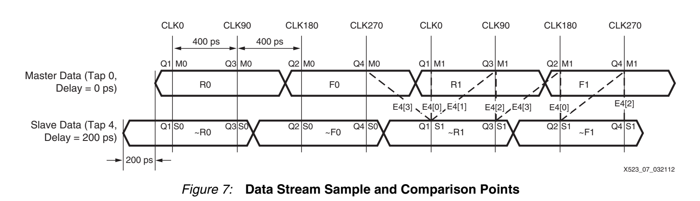
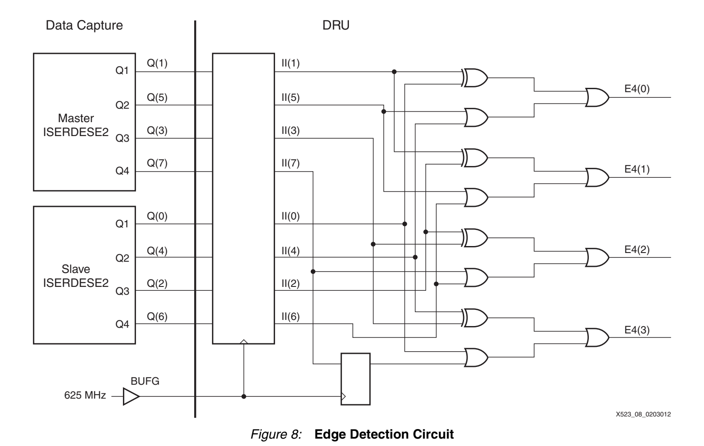
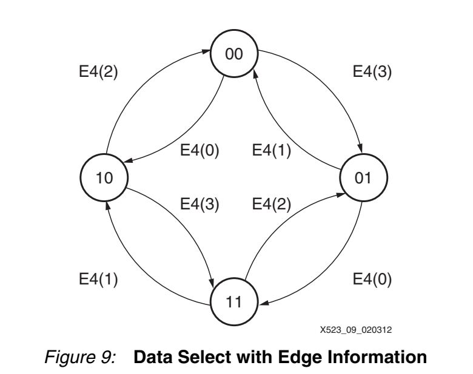
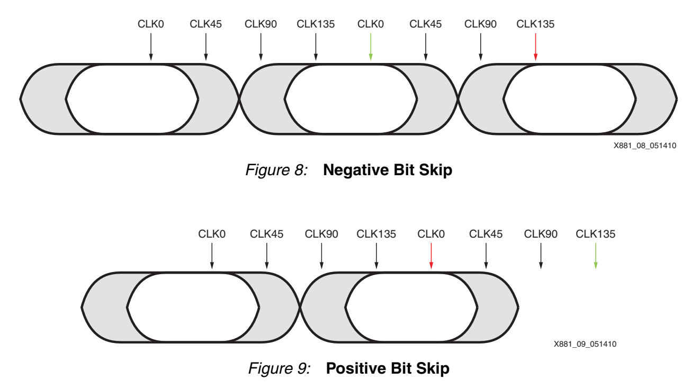
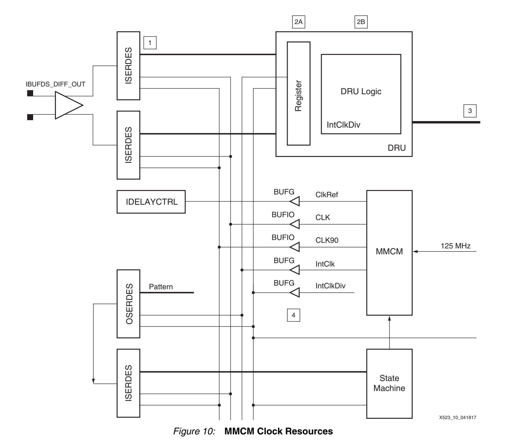

# XAPP523：7 Series LVDS 4 倍异步过采样与 DRU

> XAPP523 使用 7 Series SelectIO 中的 `ISERDESE2`、`IODELAYE2` 和 `MMCME2_ADV`，在不传送随路时钟的条件下接收 1.25 Gb/s LVDS 数据；DRU 通过边沿检测、四状态采样选择和 bit skip 跟踪收发时钟的相位与频率偏差。

## 文档信息与阅读目的

| 项目 | 内容 |
| --- | --- |
| 文档 | XAPP523 |
| 版本 | v1.1 |
| 日期 | 2017-05-17 |
| 标题 | LVDS 4x Asynchronous Oversampling Using 7 Series FPGAs and Zynq-7000 AP SoCs |
| 目标速率 | 1.25 Gb/s |
| 本笔记重点 | 4倍采样、8样本重映射、E4、FSM、bit skip、时钟校准与固定10-bit接口 |

本文把 XAPP523 作为高速 SelectIO 过采样方案的实现依据。原语、时钟网络、延迟参数和约束均按 7 Series 结构说明。

## 核心结论

- 该电路恢复完整数据，但不生成真正的 recovered clock。
- `CLK`和`CLK90`的四个边沿先提供每个数据位两个采样点，再由0 ps/200 ps两条数据路径把采样密度加倍为4 samples/UI。
- 625 MHz周期覆盖两个800 ps UI，因此每个内部处理周期共有8个样本。
- `Q(0)～Q(7)`是为DRU逻辑重新映射的内部编号，不是按绝对时间简单递增的原语端口编号。
- `E4[3:0]`用于发现边沿所在的200 ps区间，四状态FSM选择远离边沿的样本。
- `10↔00`跨越循环相位边界时执行negative或positive bit skip。
- 5/6/7 bit是名义6-bit内部示例；最终接口固定为10 bit，并使用312.5 MHz时钟和clock enable。
- BUFIO与BUFG没有固定相位关系，必须通过反馈校准使两套625 MHz时钟对齐。

## 总体架构

```text
1.25 Gb/s LVDS
       │
       ▼
IBUFDS_DIFF_OUT
       │
       ├──► IODELAYE2：0 tap ──► Master ISERDESE2
       │
       └──► IODELAYE2：4 taps ─► Slave ISERDESE2
                                      │
            CLK/CLK90，625 MHz ───────┘
                                      │
                                      ▼
                              8个内部采样结果
                                      │
                                      ▼
                           E4边沿检测与四状态FSM
                                      │
                                      ▼
                           bit skip、缓冲和数据重组
                                      │
                                      ▼
                      10-bit + 312.5 MHz + clock enable
```



*图 1：Figure 4 使用 `MMCME2`、BUFIO、两条 `IODELAYE2` 数据路径和 Master/Slave `ISERDESE2`构成4倍异步过采样接收器。来源：XAPP523 v1.1，第4页。*

## 时间参数与4倍过采样

数据速率为：

$$
R_\text{data}=1.25\text{ Gb/s}
$$

一个UI为：

$$
T_\text{UI}=\frac{1}{1.25\text{ GHz}}=800\text{ ps}
$$

625 MHz时钟周期为：

$$
T_\text{CLK}=\frac{1}{625\text{ MHz}}=1600\text{ ps}=2\text{ UI}
$$

`CLK`和`CLK90`相差90°。利用两个时钟的上升沿和下降沿得到：

```text
CLK↑        CLK90↑      CLK↓        CLK90↓
0 ps        400 ps      800 ps      1200 ps
```

仅使用四个时钟边沿时，每个800 ps数据位有两个采样点。将输入复制成0 ps和200 ps两条数据路径后，每个UI中的等效采样位置变为：

```text
Master      Slave       Master      Slave
0 ps        200 ps      400 ps      600 ps
```

因此：

$$
\frac{800\text{ ps}}{200\text{ ps}}=4\text{ samples/UI}
$$

### 为什么内部有8个样本

一个625 MHz周期包含两个UI：

$$
2\text{ UI}\times4\text{ samples/UI}=8\text{ samples}
$$

所以“4倍过采样”和“8个内部样本”描述的是不同层次：

- 4倍：每个数据位有4个候选样本；
- 8个：一个625 MHz并行处理周期覆盖两个数据位。



*图 2：一个625 MHz周期内的8个逻辑采样相位。该通用原理图基于XAPP881 Figure 2，采样关系同样适用于XAPP523的4 samples/UI结构。*

## IODELAYE2延迟设置

XAPP523的示例计算为：

1. 1.25 Gb/s对应800 ps/UI；
2. 四分之一UI为200 ps；
3. `IDELAYCTRL`使用约310 MHz参考时钟时，每tap约52 ps；
4. 所需tap数为：

$$
\frac{200\text{ ps}}{52\text{ ps/tap}}\approx3.8
$$

所以设置为：

```text
Master IODELAYE2：IDELAY_VALUE = 0
Slave  IODELAYE2：IDELAY_VALUE = 4
```

“4 taps约等于200 ps”只适用于文档规定的延迟原语和参考时钟条件。移植时必须根据目标器件数据手册重新计算。

## ISERDESE2 OVERSAMPLE模式

XAPP523使用 `ISERDESE2` 的 `OVERSAMPLE` 模式：

```text
INTERFACE_TYPE = "OVERSAMPLE"
SERDES_MODE    = "MASTER"
DATA_WIDTH     = 4
DATA_RATE      = "DDR"
IOBDELAY       = "IFD"
```

在该模式下，可以把一个 `ISERDESE2`理解为两组专用IDDR采样单元。Master与Slave分别接收0 ps和200 ps数据路径，从而组合出8个内部样本。

OVERSAMPLE模式的输出由高速 `CLK/CLKB` 和 `OCLK/OCLKB`产生，不像NETWORKING模式那样自动完成到低速 `CLKDIV` 域的并行转换。因此，输出需要先进入由BUFG时钟驱动的SLICE寄存器。

## 采样位置与内部重映射



*图 3：Figure 7 展示0 ps/200 ps两条数据路径、四个时钟边沿以及相邻200 ps的E4比较区间。来源：XAPP523 v1.1，第7页。*

ISERDESE2输出重新映射到DRU内部总线：

| DRU内部编号 | ISERDESE2来源 |
| --- | --- |
| `Q(0)` | Slave `Q1` |
| `Q(1)` | Master `Q1` |
| `Q(2)` | Slave `Q3` |
| `Q(3)` | Master `Q3` |
| `Q(4)` | Slave `Q2` |
| `Q(5)` | Master `Q2` |
| `Q(6)` | Slave `Q4` |
| `Q(7)` | Master `Q4` |

按原语端口分组：

```text
Slave Q1/Q3/Q2/Q4  → Q(0)/Q(2)/Q(4)/Q(6)
Master Q1/Q3/Q2/Q4 → Q(1)/Q(3)/Q(5)/Q(7)
```

这里的内部编号服务于E4、FSM和并行数据选择，不能直接当作绝对物理时间表。



*图 4：Figure 8 给出Master/Slave `ISERDESE2`输出到`Q(0)～Q(7)`、流水寄存器`II`和`E4[3:0]`的连接。来源：XAPP523 v1.1，第8页。*

## E4边沿检测

四个比较结果覆盖相邻的200 ps区间。每个 `E4[n]`包含两个XOR，是因为一个625 MHz周期内需要检查两个数据位的对应边沿位置：

$$
\begin{aligned}
E4[0]={}&(Q1M1\oplus Q1S1)\\
        &\lor(Q2M1\oplus Q2S1)
\end{aligned}
$$

$$
\begin{aligned}
E4[1]={}&(Q3M1\oplus Q1S1)\\
        &\lor(Q4M1\oplus Q2S1)
\end{aligned}
$$

$$
\begin{aligned}
E4[2]={}&(Q3M1\oplus Q3S1)\\
        &\lor(Q4M1\oplus Q4S1)
\end{aligned}
$$

$$
\begin{aligned}
E4[3]={}&(Q1M1\oplus Q4S0)\\
        &\lor(Q2M1\oplus Q3S1)
\end{aligned}
$$

其中：

- `M/S`表示Master或Slave；
- 后缀`1`表示当前采样组；
- 后缀`0`表示前一采样组；
- `Q4S0`保存前一组样本，用于完成并行采样组首尾之间的连续比较。

只要任一对应XOR为1，就表示该200 ps区间内出现了数据跳变。

## 四状态相位跟踪器



*图 5：Figure 9 给出四状态Data Select FSM及E4驱动的相位移动。来源：XAPP523 v1.1，第9页。*

状态及其选择的数据为：

| 状态 | 选择样本 |
| --- | --- |
| `00` | `Q(0)`和`Q(4)` |
| `01` | `Q(1)`和`Q(5)` |
| `11` | `Q(2)`和`Q(6)` |
| `10` | `Q(3)`和`Q(7)` |

状态使用Gray顺序：

```text
00、01、11、10
```

状态表示当前采用哪一组候选采样点，不直接表示边沿所在区间。状态转移关系为：

| 当前状态 | 条件 | 下一状态 |
| --- | --- | --- |
| `00` | `E4[0]=1` | `10` |
| `00` | `E4[1]=1` | `01` |
| `01` | `E4[3]=1` | `00` |
| `01` | `E4[0]=1` | `11` |
| `11` | `E4[2]=1` | `01` |
| `11` | `E4[1]=1` | `10` |
| `10` | `E4[3]=1` | `11` |
| `10` | `E4[2]=1` | `00` |

离开当前状态的条件均不成立时，FSM保持原状态。这表示当前采样点仍然远离边沿，是正常锁定行为。

DRU不是多数表决器。其控制过程是：

```text
相邻样点异或
  → 定位边沿
  → 调整采样相位
  → 选择远离边沿的样本
```

## 循环相位与Bit Skip

把状态选择沿数据组展开：

```text
当前数据组                         下一数据组
00       01       11       10 | 00       01
phase 0  phase 1  phase 2  phase 3 | phase 0
```

这里的phase是解释选择器环绕的逻辑坐标，不是对ISERDESE2端口绝对时间的重新编号。



*图 6：`10→00`和`00→10`跨越循环选择边界时的数据数量修正。该通用原理图基于XAPP881 Figure 8/9，其bit-skip关系与XAPP523一致。*

### Negative Bit Skip：`10→00`

状态`10`选择`Q(3)/Q(7)`，随后进入下一数据组的`00`并选择`Q(0)/Q(4)`。其中一个候选数据已被前一状态覆盖，因此删除一个重复样本。

### Positive Bit Skip：`00→10`

反方向跨越选择器边界时，两个连续选择之间存在一个尚未覆盖的数据，因此把额外保存的样本加入当前结果。

对于名义6-bit内部并行数据：

| 情况 | 有效数据数量 |
| --- | ---: |
| Negative bit skip | 5 bit |
| 无bit skip | 6 bit |
| Positive bit skip | 7 bit |

更一般地表示为：

$$
N-1,\quad N,\quad N+1
$$

5/6/7 bit是文档采用的名义并行示例，不代表固定积累三个周期。

## 固定10-bit用户接口

内部bit skip产生的可变数据数量先进入缓冲和重组逻辑，最终接口保持固定：

```text
10-bit data
312.5 MHz clock
clock enable
```

平均吞吐率为：

$$
10\times312.5\text{ MHz}\times CE_\text{avg}=1.25\text{ Gb/s}
$$

因此：

$$
CE_\text{avg}=0.4
$$

即平均约40%的312.5 MHz周期输出一个有效10-bit字。用户逻辑通过clock enable判断当前并行字是否有效，而不会直接看到5-bit或7-bit总线。

## 时钟体系与完整数据流



*图 7：Figure 10 展示`MMCME2`、BUFIO/BUFG、`IDELAYCTRL`、Master/Slave `ISERDESE2`、校准用`OSERDESE2`以及DRU数据流。来源：XAPP523 v1.1，第11页。*

文档中的主要时钟为：

| 时钟 | 频率 | 网络 | 用途 |
| --- | ---: | --- | --- |
| 系统输入 | 125 MHz | 输入 | `MMCME2_ADV`参考 |
| `CLK` | 625 MHz | BUFIO | `ISERDESE2`高速采样 |
| `CLK90` | 625 MHz | BUFIO | 第二采样相位 |
| `IntClk` | 625 MHz | BUFG | DRU第一级SLICE寄存器 |
| `IntClkDiv` | 312.5 MHz | BUFG | 后级DRU和用户接口 |
| `ClkRef` | 约310 MHz | 全局 | `IDELAYCTRL`参考 |

`CLK/CLK90`与`IntClk/IntClkDiv`均由同一个 `MMCME2_ADV`产生，但BUFIO和BUFG的路由及缓冲延迟不同，其相位关系不能仅由共同来源保证。

## BUFIO/BUFG相位校准

校准路径使用一个固定训练回路：

```text
BUFG域 OSERDESE2发送固定1010模式
               │
               ▼
            反馈路径
               │
               ▼
BUFIO域相邻ISERDESE2捕获
               │
               ▼
状态机判断BUFIO/BUFG相位差
               │
               ▼
MMCME2_ADV动态相移BUFG时钟
```

校准的目标是使BUFIO驱动的ISERDESE2采样时钟与BUFG驱动的DRU寄存器时钟匹配。它校准的是FPGA内部时钟网络，不是从输入数据中恢复时钟。

## 时序与布局要求

XAPP523结构的关键要求包括：

- `CLK`和`CLK90`必须通过单时钟区域BUFIO驱动ISERDESE2；
- ISERDESE2输出到第一级DRU SLICE寄存器的路径延迟不得超过600 ps；
- 第一级DRU逻辑应靠近对应I/O和ISERDESE2放置；
- `IntClk`与`IntClkDiv`同相，625 MHz到312.5 MHz阶段不需要额外异步CDC；
- 每个相关I/O Bank需要保留一组 `ISERDESE2/OSERDESE2`资源用于相位校准；
- `MMCME2_ADV`、`IDELAYCTRL`、BUFIO覆盖范围和I/O Bank必须作为整体规划。

这些约束是功能架构的一部分，不能只复制E4和FSM而忽略高速采样及跨时钟网络条件。

## 资源组织

文档的双通道参考结构说明：

- 一个 `MMCME2_ADV`服务相关I/O Bank；
- 一个I/O Bank最多可容纳约19个接收通道；
- 需要预留一组 `ISERDESE2/OSERDESE2`用于时钟相位校准；
- 每个数据通道使用两条 `IODELAYE2`路径和Master/Slave `ISERDESE2`。

实际可用通道数还受到封装、I/O标准、BUFIO时钟区域、速度等级和布局的限制。

## 接收眼图与抖动容限

DRU需要始终保留两个有效采样点，因此基础眼图要求为：

$$
0.500\text{ UI}
$$

采样相位误差预算为：

$$
0.125\text{ UI}
$$

所以接收眼图要求为：

$$
0.500+0.125=0.625\text{ UI}
$$

允许的总抖动为：

$$
1-0.625=0.375\text{ UI}
$$

采样相位误差包括：

- `MMCME2_ADV`抖动和相位误差；
- `CLK/CLK90`占空比失真；
- `IODELAYE2`延迟精度和码型相关抖动；
- Master/Slave数据路径偏差。

0.375 UI是文档规定结构和条件下的指标，不能直接推广到任意器件、MMCM配置或板级链路。

## 设计边界与工程提醒

1. **需要足够的数据跳变密度**：长连0或长连1时，FSM只能保持已有相位，不能获得新的漂移信息。
2. **过采样不能消除亚稳态**：它通过选择远离边沿的样本限制风险，而不是证明采样寄存器永不亚稳。
3. **内部编号不能代替物理时间**：`Q(0)～Q(7)`、E4区间和原语端口是不同坐标。
4. **延迟tap必须重新核算**：4 taps约200 ps不是跨器件通用常数。
5. **不能忽略时钟校准**：BUFIO/BUFG对齐和600 ps路径是高速实现的必要条件。
6. **固定接口不等于没有bit skip**：可变内部数据数量由缓冲、clock enable和固定10-bit输出共同吸收。

## 与XAPP1294的关系

| 对比项 | XAPP523 | XAPP1294 |
| --- | --- | --- |
| 采样结构 | `IODELAYE2 + Master/Slave ISERDESE2` | `IDDR`双边沿采样 |
| 示例速率 | 1.25 Gb/s | 200 Mb/s |
| 内部样本 | 8个重映射样本 | 4-bit raw samples |
| 边沿检测 | `E4[3:0]` | `E4[3:0]` |
| 相位跟踪 | 四状态FSM | 四状态FSM |
| 频差补偿 | bit skip | bit skip |
| 用户接口 | 固定10-bit + clock enable | 3-bit data + 3-bit valid |
| 额外要求 | BUFIO/BUFG校准、600 ps路径 | 轻量IDDR结构 |

两者共享DRU算法思想，但原语、样本编号、时钟结构和输出接口不能直接混用。

## FAQ

### 为什么有8个样本却称为4倍过采样？

一个625 MHz周期覆盖两个UI，每个UI有4个候选样本，所以内部一次得到8个样本。

### 为什么需要两条数据路径？

四个时钟边沿本身每UI只能提供两个采样点。把第二条数据路径延迟200 ps后，可以在原采样点之间插入新的候选点。

### 为什么状态保持不动？

只要边沿没有靠近当前选择的采样点，该采样点就是安全位置，保持状态是正常锁定行为。

### 为什么`10↔00`会触发bit skip？

两个状态位于循环选择序列的首尾。跨越它们会改变候选数据所属的并行数据组，需要删除重复位或补入未覆盖位。

### 为什么最终输出固定为10 bit？

内部5/6/7-bit数据先经过缓冲和重组，后级再以312.5 MHz时钟和clock enable输出固定10-bit并行字。

## See Also

- [[XAPP1294 基于IDDR的4倍异步过采样与DRU]]：使用IDDR和1/2/3-bit valid接口的轻量方案。
- [[基于IDDR的4倍异步过采样与数据恢复]]：包含具体工程时钟缩放和Verilog实现。
- [[Xilinx过采样CDR文档索引]]：后续NIDRU和突发CDR文档导航。

## References

- Xilinx, *LVDS 4x Asynchronous Oversampling Using 7 Series FPGAs and Zynq-7000 AP SoCs*, XAPP523 v1.1, 2017-05-17。
- 本地原始文档：`D:\0_MySpace\01_技术文档\05_FPGA_learning\xapp523-lvds-4x-asynchronous-oversampling.pdf`
- 两张通用原理图基于XAPP881 Figure 2及Figure 8/9，已复制为本笔记独立资源；其内容不包含Virtex-6专用硬件原语。

## Tags

`FPGA` `7-Series` `Zynq-7000` `LVDS` `Oversampling` `DRU` `ISERDESE2` `IODELAYE2` `MMCME2_ADV` `Bit-Skip` `XAPP523`
