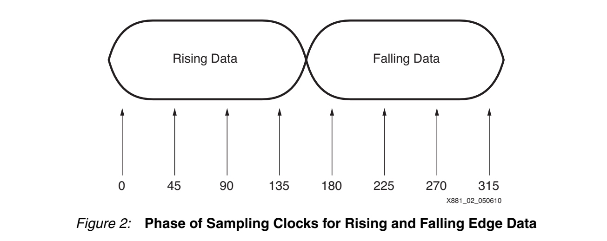
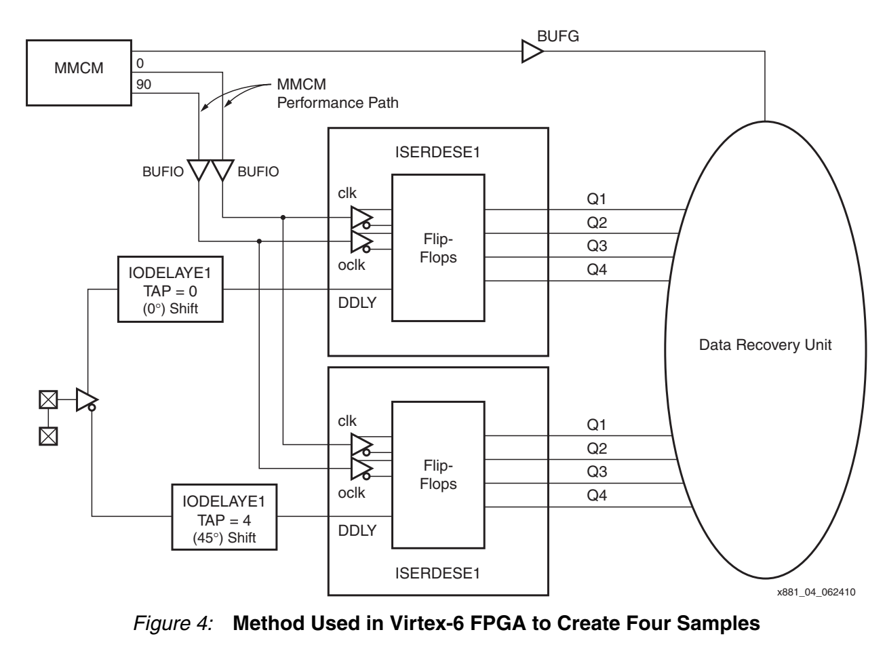
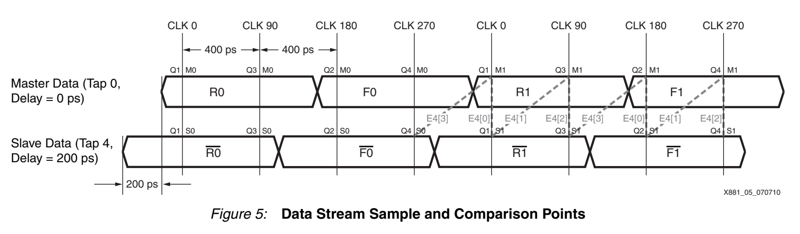
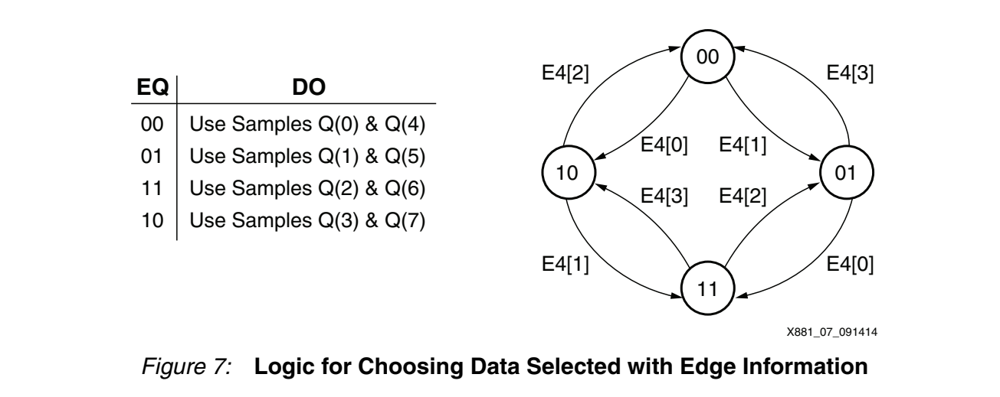
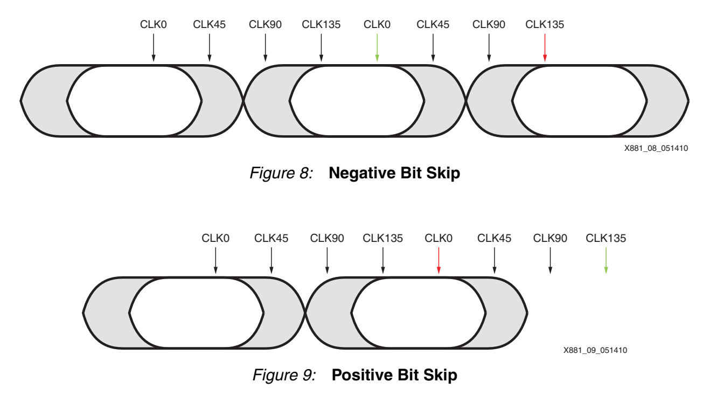
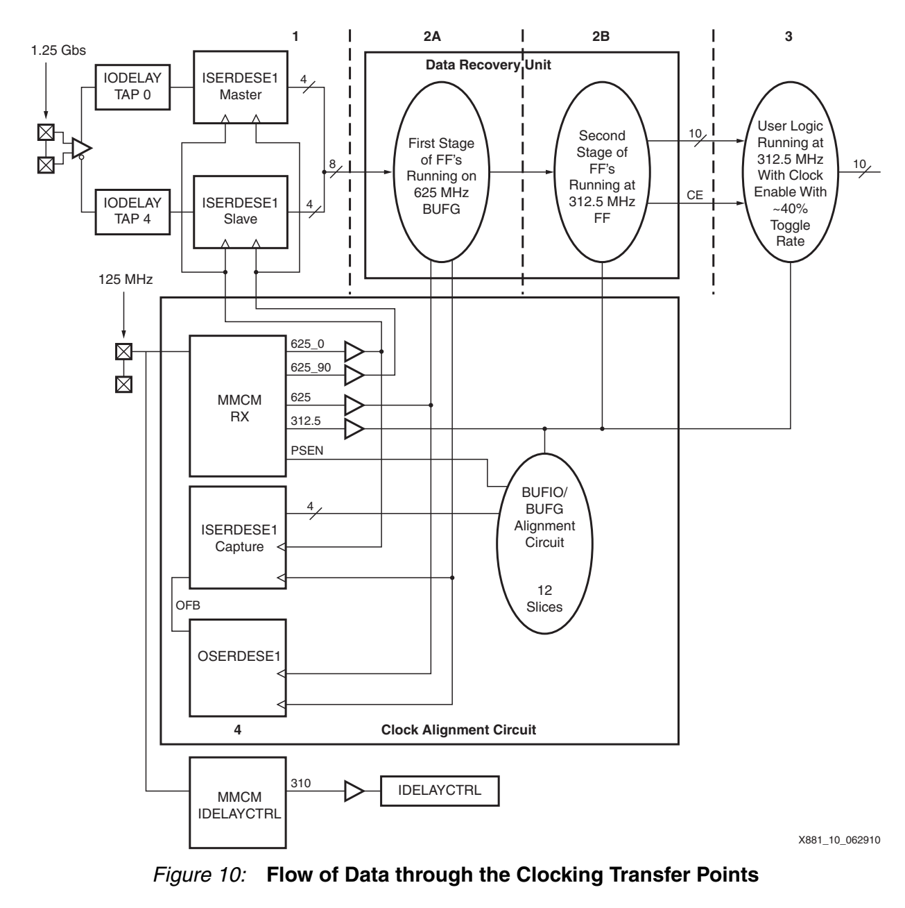

# XAPP881：Virtex-6 4 倍异步过采样与 DRU

> XAPP881 使用 Virtex-6 SelectIO 中的 `ISERDESE1`、`IODELAYE1` 和 MMCM，在不传送随路时钟的条件下接收 1.25 Gb/s LVDS 数据；DRU 通过边沿检测、四状态采样选择和 bit skip 跟踪收发时钟的相位与频率偏差。

## 文档信息与阅读目的

| 项目 | 内容 |
| --- | --- |
| 文档 | *Virtex-6 FPGA LVDS 4X Asynchronous Oversampling at 1.25 Gb/s* |
| 编号与版本 | XAPP881 v1.1 |
| 日期 | 2014-09-24 |
| 作者 | Catalin Baetoniu、Brandon Day |
| 厂商与器件 | Xilinx Virtex-6 FPGA |
| 主要原语 | `IBUFDS_DIFFOUT`、`IODELAYE1`、`ISERDESE1`、MMCM、BUFIO、BUFG |

本文重点解释：

- 4 倍过采样如何形成 8 个并行样本；
- DRU 如何检测边沿并选择安全采样点；
- `Q1～Q4`、Master/Slave 和内部 `Q(0)～Q(7)` 三套编号的区别；
- `10↔00` 为什么触发 bit skip；
- 时钟校准、时序约束、资源和抖动容限。

> [!IMPORTANT]
> XAPP881 是 Virtex-6/ISE 时代的器件专用方案。文中的原语、约束语法和实测指标不能直接推广到其他 FPGA 系列或现代 Vivado 工程。

## 核心结论

- 1.25 Gb/s 数据的一个 UI 为 800 ps。
- 625 MHz 时钟周期为 1600 ps，覆盖两个数据位。
- `CLK0`、`CLK90` 的双边沿与一路约 200 ps 延迟的数据共同形成 8 个等效相位，即每个 UI 有 4 个候选样本。
- DRU 不是多数表决器，而是“边沿检测 + 离散相位跟踪 + 样本选择器”。
- 状态表示当前选择的采样相位，不直接表示数据边沿所在区间。
- `10→00`为 Negative bit skip，`00→10`为 Positive bit skip；它们校正异步时钟长期频差导致的位序重复或空缺。
- 文档中的 5/6/7 bit 是一个名义 6-bit 并行数据示例，不代表固定三周期结构；最终用户接口宽度为 10 bit。

## 总体架构

发送端和接收端分别使用独立的 125 MHz、±100 ppm 时钟。接收端将本地 125 MHz 时钟倍频到 625 MHz，并用多个相位对输入数据过采样。DRU 从并行样本中恢复连续数据，不要求生成一个连续可调的模拟恢复时钟。

```text
1.25 Gb/s LVDS
      ↓
IBUFDS_DIFFOUT
      ↓
Master/Slave IODELAYE1 + ISERDESE1
      ↓
8 个并行过采样结果
      ↓
E4 边沿检测
      ↓
四状态相位选择
      ↓
bit skip 与数据拼接
      ↓
10-bit data + clock enable
```

## 时间参数与 4 倍过采样

输入数据速率为：

$$
R_{data}=1.25\ \mathrm{Gb/s}
$$

一个数据位的持续时间为：

$$
T_{UI}=\frac{1}{1.25\ \mathrm{GHz}}=800\ \mathrm{ps}
$$

采样时钟为 625 MHz：

$$
T_{CLK}=\frac{1}{625\ \mathrm{MHz}}=1600\ \mathrm{ps}=2UI
$$

MMCM 产生 `CLK0` 和 `CLK90`。90° 相移对应：

$$
1600\ \mathrm{ps}\times\frac{90^\circ}{360^\circ}=400\ \mathrm{ps}
$$

`ISERDESE1` 同时使用两个时钟的上升沿和下降沿，因此基础时钟相位为 0°、90°、180°、270°。Slave 数据路径再通过 `IODELAYE1 TAP=4` 引入约 200 ps，也就是 45° 的数据相移，从而把基础相位数量加倍。



*图 1：Figure 2 展示 0°～315° 的 8 个相位。一个 625 MHz 周期包含两个 UI，因此 8 个样本等价于每个数据位 4 个候选样本。来源：XAPP881 v1.1，第 2 页。*

## Virtex-6 采样硬件



*图 2：Figure 4 使用 MMCM 的 0°/90°输出、两条 IODELAYE1 路径以及 Master/Slave ISERDESE1 组合出 8 个等效相位。来源：XAPP881 v1.1，第 4 页。*

### Master 与 Slave 数据路径

| 路径 | 配置 | 作用 |
| --- | --- | --- |
| Master | `IODELAYE1 TAP=0` | 采样未附加延迟的数据路径 |
| Slave | `IODELAYE1 TAP=4` | 采样延迟约 200 ps 的数据路径 |

两条路径使用相同的 `CLK0` 和 `CLK90`。比较同一时钟边沿下的 Master/Slave 输出，就能判断数据跳变是否位于两个相差约 200 ps 的等效采样点之间。

### 延迟波形与等效采样坐标

必须区分两种描述：

1. **物理波形描述**：Slave 数据波形相对于 Master 延迟约 200 ps。
2. **等效采样描述**：在同一时钟时刻采样延迟后的数据，相当于观察原始输入波形更早的历史值。

因此，不能只凭“哪条数据线被延迟”判断 DRU 内部样本的时间顺序。本文在解释 bit skip 时使用 XAPP881 Figure 8/9 的**循环逻辑相位顺序**，而不把 Figure 5 中的原语端口位置直接当成最终并行位序。

## ISERDESE1 输出端口

在本文配置中，`Q1～Q4` 不是简单的时间递增编号。Figure 5 给出的采样关系为：

| 输出 | 采样时钟相位 |
| --- | --- |
| `Q1` | CLK0 |
| `Q3` | CLK90 |
| `Q2` | CLK180 |
| `Q4` | CLK270 |

`Q1/Q2` 是相隔一个 UI 的同类样本，`Q3/Q4` 也是相隔一个 UI 的同类样本。

## DRU 内部 `Q(0)～Q(7)` 重映射

Figure 6 将两个 `ISERDESE1` 的输出整理为 DRU 内部总线：

| DRU 编号 | ISERDESE1 来源 |
| --- | --- |
| `Q(0)` | Slave `Q1` |
| `Q(1)` | Master `Q1` |
| `Q(2)` | Slave `Q3` |
| `Q(3)` | Master `Q3` |
| `Q(4)` | Slave `Q2` |
| `Q(5)` | Master `Q2` |
| `Q(6)` | Slave `Q4` |
| `Q(7)` | Master `Q4` |

该映射建立了一个重要关系：

$$
Q(n)\ \text{与}\ Q(n+4)\ \text{是相邻两个数据位置的同组候选样本}
$$

状态机每次选择一对：

| 状态 | 选择样本 |
| --- | --- |
| `00` | `Q(0)`、`Q(4)` |
| `01` | `Q(1)`、`Q(5)` |
| `11` | `Q(2)`、`Q(6)` |
| `10` | `Q(3)`、`Q(7)` |

> [!CAUTION]
> `Q(0)～Q(7)` 是 DRU 内部逻辑编号。讨论 Figure 5 的物理采样位置、Figure 6 的总线编号和 Figure 8/9 的跨块位序时，应分别说明所用坐标，不应仅凭下标推导绝对物理时间。

## E4 边沿检测



*图 3：Figure 5 展示 Master/Slave 数据、四个时钟相位和 `E4[3:0]` 比较区间。来源：XAPP881 v1.1，第 5 页。*

相邻候选样本通过 XOR 检测跳变：

$$
Edge=A\oplus B
$$

- XOR = 0：两个样本电平相同；
- XOR = 1：两个采样点之间存在电平跳变。

XAPP881 定义四个比较结果：

$$
\begin{aligned}
E4[0]={}&(Q1M1\oplus Q1S1)\\
        &\lor(Q2M1\oplus Q2S1)
\end{aligned}
$$

$$
\begin{aligned}
E4[1]={}&(Q3M1\oplus Q1S1)\\
        &\lor(Q4M1\oplus Q2S1)
\end{aligned}
$$

$$
\begin{aligned}
E4[2]={}&(Q3M1\oplus Q3S1)\\
        &\lor(Q4M1\oplus Q4S1)
\end{aligned}
$$

$$
\begin{aligned}
E4[3]={}&(Q1M1\oplus Q4S0)\\
        &\lor(Q2M1\oplus Q3S1)
\end{aligned}
$$

其中：

- `M/S` 表示 Master/Slave；
- 后缀 `1` 表示当前采样组；
- 后缀 `0` 表示前一采样组。

每个 `E4[n]` 使用两个 XOR 再 OR，是因为一个 625 MHz 周期包含两个数据位；只要其中一个位置在相应区间观察到跳变，该 `E4[n]` 就置 1。

`E4[3]` 使用前一采样组的 `Q4S0`，用于完成并行采样组首尾之间的连续边沿检测。

## 四状态相位跟踪器



*图 4：Figure 7 左侧给出状态与输出样本组，右侧给出边沿信息驱动的状态转移。来源：XAPP881 v1.1，第 6 页。*

状态采用 Gray 编码：

```text
00、01、11、10
```

状态表示当前采用哪一组候选样本，不直接表示边沿位于哪个 `E4` 区间。Figure 7 的转移关系为：

| 当前状态 | 条件 | 下一状态 |
| --- | --- | --- |
| `00` | `E4[0]=1` | `10` |
| `00` | `E4[1]=1` | `01` |
| `01` | `E4[3]=1` | `00` |
| `01` | `E4[0]=1` | `11` |
| `11` | `E4[2]=1` | `01` |
| `11` | `E4[1]=1` | `10` |
| `10` | `E4[3]=1` | `11` |
| `10` | `E4[2]=1` | `00` |

如果离开当前状态的条件均不成立，FSM 保持原状态。这种行为意味着：

- 边沿远离当前采样点时，不需要切换；
- 边沿逐渐靠近当前采样点时，切换到相邻候选相位；
- 长连 0 或长连 1 时没有新的边沿信息，FSM 保持原状态。

该 DRU 更接近离散数字相位跟踪器，而不是传统模拟 PLL/CDR。文档中的 “voter system” 也不是对 8 个样本做多数表决，而是根据边沿位置选择更可靠的样本。

## Bit Skip

收发时钟存在频率偏差时，数据边沿会持续相对采样相位漂移。当采样选择在循环相位序列的端点之间切换时，位序相对于并行数据块发生一次环绕。

用于理解 Figure 8/9 的归一化逻辑相位轴为：

```text
当前数据块                         下一数据块
00       01       11       10 | 00       01
phase 0  phase 1  phase 2  phase 3 | phase 0
```

这里的 `phase 0～phase 3` 是解释选择器环绕的逻辑坐标，不应直接替代 Figure 5 中每个原语端口的绝对物理位置。



*图 5：Figure 8、Figure 9 分别展示 `10→00` 和 `00→10` 时的数据数量校正。来源：XAPP881 v1.1，第 7 页。*

### Negative Bit Skip：`10→00`

状态 `10` 使用 `Q(3)/Q(7)`，状态 `00` 使用 `Q(0)/Q(4)`。沿 Figure 8 的数据选择方向从最后一个逻辑相位进入下一数据块的第一个逻辑相位时，一个候选数据已经在前一选择中使用，因此丢弃一个重复样本。

### Positive Bit Skip：`00→10`

反方向跨越选择器边界时，两个选择结果之间存在一个尚未覆盖的候选数据，因此把额外保存的样本与当前数据一起送入后级。

### 5/6/7 bit 的准确含义

XAPP881 写道，对于一个名义 6-bit 并行数据示例：

| 情况 | 有效数据数量 |
| --- | ---: |
| Negative bit skip | 5 bit |
| 无 bit skip | 6 bit |
| Positive bit skip | 7 bit |

更一般地可理解为：

$$
N-1,\quad N,\quad N+1
$$

文档没有说明该 6-bit 示例必须来自固定三个 625 MHz 周期，也没有把它定义成最终用户接口。不能仅根据 `6÷2=3` 推断出参考 RTL 的固定流水结构。

## 10-bit 用户接口与数据流



*图 6：Figure 10 展示 1.25 Gb/s 输入、ISERDESE1 捕获、625 MHz/312.5 MHz DRU、10-bit接口及BUFIO/BUFG校准路径。来源：XAPP881 v1.1，第 9 页。*

DRU 选择的数据最终整理成固定 10-bit 接口，并配合 clock enable 交给用户逻辑。10 bit 是参考设计的并行接口选择，不是由 4 倍过采样或 5/6/7 bit 必然推导出的宽度。

312.5 MHz 用户时钟下，平均 clock enable 比例约为：

$$
\frac{1.25\ \mathrm{Gb/s}}
{312.5\ \mathrm{MHz}\times10}
=40\%
$$

因此：

- 312.5 MHz 时钟持续运行；
- 只有 clock enable 有效时，当前 10-bit 数据才交给用户逻辑；
- bit skip 调整内部有效数据数量，后级再把连续数据整理为固定宽度输出。

## 时钟体系

| 来源 | 频率/相位 | 缓冲 | 目的地 |
| --- | --- | --- | --- |
| 板外振荡器 | 125 MHz | 输入缓冲 | RX MMCM |
| RX MMCM | 625 MHz，0° | 单区域 BUFIO | ISERDESE1 |
| RX MMCM | 625 MHz，90° | 单区域 BUFIO | ISERDESE1 |
| RX MMCM | 625 MHz，动态相移 | BUFG | CLB/DRU |
| RX MMCM | 312.5 MHz，动态相移 | BUFG | CLB/DRU |
| IDELAYCTRL MMCM | 310 MHz | BUFG | IDELAYCTRL |

### BUFIO/BUFG 相位校准

BUFIO 和 BUFG 的相位关系未预先定义，而 ISERDESE1 使用 BUFIO、CLB 内 DRU 使用 BUFG。参考设计通过以下流程校准：

1. 用 625 MHz BUFG 驱动 OSERDESE1；
2. 通过输出反馈路径送入 ISERDESE1；
3. 用 625 MHz BUFIO 重新捕获；
4. 判断两个时钟网络的相位关系；
5. 使用 MMCM 独立动态相移，使 BUFG 与 BUFIO 对齐。

该校准是 ISERDESE1 到 CLB 高速数据转移的重要前提。

## 时序与布局要求

XAPP881 针对 Virtex-6/ISE 给出的关键要求包括：

- 125 MHz、625 MHz 和 312.5 MHz 时钟必须建立周期约束；
- ISERDESE1 到第一级 CLB 寄存器的最大延迟不超过 600 ps；
- 高速捕获时钟使用单区域 BUFIO；
- DRU 的关键 CLB 阵列可能需要 `RLOC`；
- 625 MHz 与 312.5 MHz BUFG 时钟保持同相；
- BUFIO/BUFG 通过动态相移完成对齐。

这些 `TIMESPEC`、`MAXDELAY` 和 `RLOC` 示例属于 ISE 约束体系。迁移到 Vivado 或其他器件时，需要重新建立功能等价的时钟、布局和最大延迟约束，不能直接复制语法。

## 资源使用

### 每器件

| 资源 | 数量 |
| --- | ---: |
| MMCM | 1 |
| BUFG | 1 |

### 每 I/O Bank

| 资源 | 数量 |
| --- | ---: |
| MMCM | 1 |
| BUFG | 2 |
| 单区域 BUFIO | 2 |
| 时钟校准电路 | 45 LUT |
| IDELAYCTRL | 1 |
| 校准用 ISERDESE1 | 1 |
| 校准用 OSERDESE1 | 1 |

### 每通道

| 资源 | 数量 |
| --- | ---: |
| DRU | 87 LUT |
| ISERDESE1 | 2 |
| IODELAYE1 | 2 |

## 接收眼图与抖动容限

DRU 要求始终存在两个有效采样点，因此基础眼图要求为 0.500 UI。加入 0.125 UI 的采样相位误差：

$$
0.625UI=0.500UI+0.125UI
$$

文档给出的 1.25 Gb/s 表征结果为 0.375 UI 总抖动容限，覆盖 -2/-3 速度等级、不同电压以及 -40°C/100°C 条件。

采样相位误差包括：

- 参考设计配置下的 MMCM 抖动；
- MMCM `CLK0/CLK90` 相位误差；
- MMCM 占空比失真；
- IODELAYE1 延迟精度和码型相关抖动；
- Master/Slave ISERDESE1 路径偏差。

明确不包括：

- 其他 MMCM 频率和配置；
- 板级信号完整性损失、ISI 和板级抖动；
- 文档未明确列入的其他误差。

## 设计边界与工程提醒

1. **需要数据跳变**：DRU 依靠 XOR 获取边沿信息。长连 0/1 时可以保持当前数据值，但不能获得新的相位漂移信息。
2. **过采样不消除亚稳态**：靠近边沿的采样仍有风险；设计通过 ISERDESE1 内部级联和远离边沿的样本选择降低传播风险。
3. **bit skip 是校正，不是错误**：它删除重复候选位或补入未覆盖候选位，使最终位流连续。
4. **坐标系必须明确**：物理数据延迟、等效原始数据采样位置、内部 `Q(n)` 编号和跨并行块位序不可混为一谈。
5. **6 bit 是文档示例**：正文没有给出“必须累积三个周期”的依据。
6. **器件指标不可迁移**：0.375 UI 和 600 ps 等指标只适用于文档规定的 Virtex-6 结构和条件。

## FAQ

### 为什么有 8 个样本却称为 4 倍过采样？

一个 625 MHz 周期覆盖两个 800 ps UI。每周期 8 个样本等于每个 UI 4 个候选样本。

### DRU 是多数表决器吗？

不是。它用相邻样本 XOR 定位边沿，再由 FSM 选择远离边沿的采样相位。

### 为什么状态保持不动？

状态表示当前选择的采样相位。只要边沿没有接近该采样点，保持状态就是正常锁定行为。

### 为什么 `10↔00`会触发 bit skip？

Figure 8/9 中这两个状态位于循环选择序列的两端。跨越它们会改变候选样本所属的并行数据块，需要删除重复位或补入未覆盖位。

### 6 bit 从哪里来？

它是文档用于说明 5/6/7 变化的名义并行数据示例。XAPP881 正文没有说明它必须由固定三个周期组成。

### 为什么最终输出为 10 bit？

10 bit 是参考设计给用户逻辑的固定并行接口宽度。后级结合 312.5 MHz 时钟和约 40% 的 clock enable 保持 1.25 Gb/s 平均吞吐率。

## See Also

- [[XAPP1294 基于IDDR的4倍异步过采样与DRU]]：使用 IDDR 和 1/2/3-bit valid 接口的轻量 4 倍过采样方案；与本笔记共享 E4、四状态 FSM 和 bit-skip 原理。
- [[基于IDDR的4倍异步过采样与数据恢复]]：面向 IDDR/XAPP1294 思路的轻量实现；其原语、时钟和吞吐量不能与本笔记的 Virtex-6 XAPP881 结构直接混用。

## References

- Xilinx, *Virtex-6 FPGA LVDS 4X Asynchronous Oversampling at 1.25 Gb/s*, XAPP881 v1.1, 2014-09-24。
- 本地原始文档：`D:\0_MySpace\01_技术文档\02_Xilinx\xapp881_V6_4X_Asynch_OverSampling.pdf`

## Tags

`FPGA` `Virtex-6` `LVDS` `Oversampling` `DRU` `ISERDESE1` `IODELAYE1` `MMCM` `Bit-Skip` `XAPP881`
